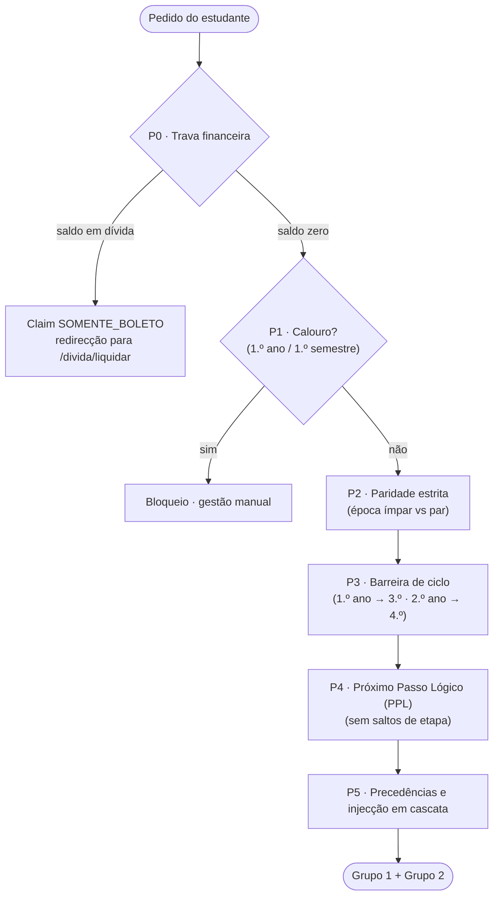

# Sistema de Inscrição Académica — UNITIVA

> Portal de inscrição semestral com motor de regras académicas, trava financeira ligada ao banco legado e emissão de guias de pagamento (boletos).
>
> **Versão:** consolidada e retificada · **Estado:** em desenvolvimento · **Fonte da verdade:** [`docs/PRD.md`](docs/PRD.md)

## Índice

1. [Visão geral e princípios arquitecturais](#1-visão-geral-e-princípios-arquitecturais)
2. [Stack tecnológica](#2-stack-tecnológica)
3. [Modelo de dados](#3-modelo-de-dados)
4. [Motor de regras](#4-motor-de-regras)
5. [Endpoints REST](#5-endpoints-rest)
6. [Comportamento da interface web](#6-comportamento-da-interface-web)
7. [Organização do trabalho em grupo e sprints](#7-organização-do-trabalho-em-grupo-e-sprints)
8. [Matriz de riscos e mitigações](#8-matriz-de-riscos-e-mitigações)
9. [Estrutura do repositório e documentação](#9-estrutura-do-repositório-e-documentação)
10. [Questões em aberto](#10-questões-em-aberto)

---

## 1. Visão geral e princípios arquitecturais

O sistema gere o ciclo completo de inscrição semestral do estudante universitário:

- autenticação com verificação de papéis;
- conciliação financeira com o banco legado;
- aplicação em cascata das regras académicas (Paridade, Barreira de Ciclo, Próximo Passo Lógico — PPL — e Precedências);
- emissão de boletos através de um pipeline transaccional.

A arquitectura assenta em três pilares inegociáveis:

| Pilar | Descrição |
|---|---|
| **Motor de regras puro (Zero-Trust)** | O servidor nunca confia na selecção enviada pelo cliente. Toda a combinação de cadeiras é recalculada a partir do histórico académico imutável antes de qualquer gravação. |
| **Dualidade de bases de dados (Prisma Multi-Client)** | Isolamento físico entre a **base externa** (fonte autoritativa de identidade e saldos) e a **base interna PostgreSQL** (fluxo transaccional, sessões, caches e inscrições). |
| **Conciliação no login seguinte** | O estudante em dívida fica confinado à liquidação das pendências. Uma inscrição `PENDENTE` é efectivada de forma automática e reactiva quando um novo login detecta saldo zero na base externa. |

---

## 2. Stack tecnológica

| Camada | Tecnologia | Justificação |
|---|---|---|
| Backend | Node.js + NestJS (TypeScript) | Modularidade orientada à injecção de dependências (`RulesEngineModule`, `FinanceiroModule`), o que facilita testes unitários determinísticos do motor de regras. |
| Frontend | Next.js 14+ (App Router) + Tailwind CSS | Server Components com *streaming* de layout, Route Handlers rápidos e tipagem TypeScript de ponta a ponta. |
| Estado do cliente | Zustand | Store de selecção de cadeiras e cascata reactiva no cliente. |
| Base de dados | PostgreSQL | Integridade referencial forte e controlo de concorrência com transacções ACID via `$transaction` do Prisma. |
| ORM | Prisma Multi-Client | `PrismaInternalClient` (PostgreSQL local) e `PrismaExternalClient` (banco legado, só de leitura). Evita mapeamentos SQL manuais e mantém a tipagem segura. |
| Geração de PDF | Serviço NestJS (`pdfmake` / `puppeteer-core`) | Geração assíncrona de boletos, com *streaming* de buffer para o volume de armazenamento e registo em `BoletoLog`. |
| Autenticação e sessão | NestJS Passport + JWT | Claim dinâmico `acesso` (`SOMENTE_BOLETO` ou `LIVRE`), definido no login em função do saldo devedor. |
| Resiliência externa | Circuit Breaker (Opossum) | Monitoriza a ligação à API/BD externa. Perante falhas contínuas, abre o circuito e recorre ao último saldo em cache. |
| Testes E2E | Playwright | Cenários completos por perfil de estudante. |

---

## 3. Modelo de dados

### 3.1 Base externa
Usado como fonte das verificações para teste.

### 3.2 Base interna
O banco real do projecto que vai guardar os estudantes matriculados com sucesso.

---

## 4. Motor de regras

As validações são executadas em cadeia no backend (`RulesEngineService`). Qualquer incoerência aborta a montagem das opções ou a submissão da inscrição.



### Regra 4.1 — Prioridade 0: trava financeira

> **A validar** — texto reconstruído a partir do pipeline e da matriz de riscos.

- Após autenticação, consulta-se `saldo_devedor` na base externa.
- Saldo superior a zero → claim `SOMENTE_BOLETO`: o estudante só acede a `/financeiro/pendencia` e `/divida/liquidar`.
- Saldo zero → claim `LIVRE`. Se existir uma `InscricaoPendente` em estado `PENDENTE`, é promovida a `EFECTIVADA` numa transacção atómica.
- Base externa indisponível → o circuit breaker abre e o sistema assume estado defensivo (*fail-closed*), lendo `PendenciaCache` (`emFallback = true`). Nunca se efectiva uma inscrição em modo de fallback.

### Regra 4.2 — Validação de calouro

> **A validar** — texto reconstruído a partir do pipeline.

Estudantes no 1.º ano / 1.º semestre não usam o portal: a inscrição é gerida manualmente pela secretaria e o acesso às rotas `/matricula/*` é bloqueado.

### Regra 4.3 — Paridade estrita

O portal opera em regime de semestres **ímpares** (1) ou **pares** (2). As cadeiras fora da paridade activa são suprimidas na raiz da árvore de decisão.

| Época activa | Semestres curriculares ofertáveis |
|---|---|
| Ímpar (1) | 1, 3, 5, 7 |
| Par (2) | 2, 4, 6, 8 |

### Regra 4.4 — Barreira de ciclo (*hard stop*)

Bloqueia a transição vertical de ciclo antes da conclusão das etapas de base:

- Para ofertar cadeiras do **3.º ano**: 100 % das cadeiras do 1.º ano têm de constar como `APROVADO` no histórico.
- Para ofertar cadeiras do **4.º ano**: 100 % das cadeiras do 2.º ano têm de constar como `APROVADO` no histórico.

Se a condição não for cumprida, o estudante não tem acesso às cadeiras do ciclo avançado e fica restrito à regularização de pendências.

### Regra 4.5 — Próximo Passo Lógico (PPL)

> **A validar** — texto reconstruído a partir do pipeline.

O semestre regular ofertado é o imediatamente seguinte ao último semestre curricular concluído. Cadeiras de semestres posteriores ficam suprimidas: não são permitidos saltos de etapa.

### Regras 4.6 e 4.7 — Inscrição híbrida, injecção automática e desmarcação em cascata

| Grupo | Composição | Estado por omissão |
|---|---|---|
| **Grupo 1 — Regulares** | Cadeiras do semestre lógico do estudante | `checked = true`, `disabled = true`. Se a precedência não estiver aprovada: `bloqueada = true`, `checked = false`. |
| **Grupo 2 — Atrasadas** | Cadeiras reprovadas ou pendentes de semestres anteriores que cumprem a paridade corrente | `checked = true`, `disabled = false` (editáveis). |

**Injecção automática por precedência em falta.** Quando uma cadeira do Grupo 1 está bloqueada por falta de precedência, o motor verifica se a disciplina precedente pertence à paridade do ciclo activo. Se pertencer, é injectada no Grupo 2 com `checked = true`, permitindo regularizar o pré-requisito de imediato.

**Cascata directa** *(a validar)*. Ao desmarcar no Grupo 2 uma cadeira que é precedência de cadeiras do Grupo 1, as cadeiras dependentes passam a `bloqueada = true` e `checked = false`. Ao voltar a marcá-la, o estado anterior é reposto.

---

## 5. Endpoints REST

| Método | Rota | Payload / Cabeçalhos | Resposta | Descrição |
|---|---|---|---|---|
| `POST` | `/auth/login` | `{ codigo, senha }` | `{ accessToken, claimAcesso, aluno }` | JWT com claim de acesso (`SOMENTE_BOLETO` ou `LIVRE`). |
| `GET` | `/financeiro/pendencia` | Bearer token | `{ saldoDevedor, boletoLiquidacaoUrl, emFallback }` | Saldo devedor e ligação para regularização. |
| `GET` | `/matricula/opcoes` | Bearer token | `{ cicloAtivo, grupo1: [], grupo2: [] }` | Cadeiras elegíveis, divididas em Grupo 1 e Grupo 2. |
| `POST` | `/matricula/simular` | `{ cadeirasIds: number[] }` | `{ valorTotal, itensValidos, advertencias: [] }` | Simulação em tempo real com recálculo determinístico. |
| `POST` | `/matricula/submeter` | Cabeçalho `Idempotency-Key`; corpo `{ cadeirasIds: number[] }` | `{ matriculaId, boletoUrl, status, total }` | Criação atómica da inscrição pendente numa transacção ACID. |
| `GET` | `/matricula/:id/boleto` | Bearer token | *Stream* do PDF (`application/pdf`) | Descarga do boleto emitido. |

---

## 6. Comportamento da interface web

- **Layout e protecção de rotas.** O `middleware.ts` intercepta os pedidos e valida o JWT. Estudantes com `acesso: "SOMENTE_BOLETO"` são redireccionados obrigatoriamente para `/divida/liquidar`, sem acesso a `/matricula/*`.
- **Grupo 1 (regulares).** Tabela superior. As cadeiras válidas mostram a caixa de selecção marcada e desactivada. As cadeiras com precedência em falta mostram um distintivo vermelho, um ícone de cadeado e uma dica explicativa.
- **Grupo 2 (atrasos opcionais).** Tabela interactiva. Ao desmarcar uma cadeira, o cliente recalcula o estado (desmarcando as regulares dependentes) e, com *debounce*, chama `POST /matricula/simular`.
- **Barra de acção fixa (rodapé).** Mostra a soma das taxas em tempo real, com indicador de carregamento. O botão «Confirmar Matrícula» gera um UUID único para o cabeçalho `Idempotency-Key` no momento da submissão.
- **Sistema de design e acessibilidade.** Modo escuro com *tokens* de alta legibilidade, contraste WCAG 2.1 AA, navegação completa por teclado e suporte a leitores de ecrã.

---

## 7. Organização do trabalho em grupo e sprints

O desenvolvimento decorre em **6 sprints semanais**, com **3 trilhas paralelas** para evitar conflitos de *branch*. A regra de ouro é **contratos primeiro**: nenhuma trilha fica bloqueada à espera de outra, porque todas trabalham contra contratos tipados e simuladores partilhados.

### 7.1 Trilhas e responsabilidades

| Trilha | Âmbito | Entrega às outras trilhas | Responsável |
|---|---|---|---|
| **A — Backend e persistência** | Schemas Prisma, migrations, módulos NestJS, autenticação, transacções ACID, PDF. | Endpoints reais, seeds, contratos REST. | _por atribuir_ |
| **B — Motor de regras e algoritmos** | `RulesEngineService`, testes unitários do motor, cálculo de taxas, simulação, segurança. | Regras P0–P5 como funções puras, catálogo de cadeiras, casos de teste. | _por atribuir_ |
| **C — Frontend e experiência do estudante** | Next.js, Tailwind, Zustand, componentes acessíveis, integração de APIs, E2E. | Interface, mocks alinhados com o contrato, testes E2E. | _por atribuir_ |

### 7.2 Regras de trabalho

1. **Contratos primeiro.** Os DTOs e tipos partilhados vivem num único pacote de contratos. Alterar um contrato exige aviso às outras trilhas e revisão de alguém de fora da trilha que o alterou.
2. **Nunca bloquear à espera de outra trilha.** A Trilha C trabalha com mock (por exemplo, MSW) até os endpoints reais existirem; a Trilha A trabalha com casos de teste do motor até o motor estar integrado.
3. **Base externa simulada.** O banco legado é externo e só de leitura, por isso o repositório inclui um simulador local com seeds por perfil de estudante (ver 7.4).
4. **Testes em cada sprint.** Cada trilha entrega testes do que implementa. O Sprint 6 serve para estabilizar, não para começar a testar.
5. **PRs pequenos.** Um PR por tarefa, revisão obrigatória e *branch protection* na `main`.

### 7.3 Cadência semanal

| Dia | Momento | Objectivo |
|---|---|---|
| Segunda | Planeamento (30 min) | Confirmar o objectivo do sprint, tarefas por trilha e dependências. |
| Quarta | Ponto de integração (15 min) | Verificar marcos intermédios e desbloquear dependências. |
| Sexta | Demo + retrospectiva (45 min) | Demonstrar o marco do sprint; registar o que mantemos, mudamos e paramos. |

### 7.4 Perfis de teste (seeds partilhados)

Definidos no Sprint 1 e usados em seeds, testes unitários, mocks e E2E:

| Perfil | Situação | Resultado esperado |
|---|---|---|
| **Calouro** | 1.º ano / 1.º semestre | Bloqueio manual (P1). |
| **Em dívida** | Saldo devedor > 0 | Claim `SOMENTE_BOLETO` (P0). |
| **Regular** | Sem atrasos nem dívidas | Só Grupo 1, tudo travado. |
| **Com atrasos** | Cadeiras reprovadas na paridade actual | Grupo 1 + Grupo 2 editável. |
| **Precedência em falta** | Cadeira regular bloqueada por precedência | Injecção automática no Grupo 2 (4.6). |
| **Bloqueado por ciclo** | 1.º ano incompleto | Sem cadeiras do 3.º ano (P3). |

### 7.5 Definição de pronto (global)

Uma tarefa só está concluída quando:

- o PR foi revisto e aprovado;
- o CI está verde (lint, tipos e testes);
- os testes cobrem o comportamento novo;
- a especificação em `docs/specs/` foi actualizada, conforme `documentation-governance.md`;
- não há segredos nem credenciais no repositório.

### 7.6 Marcos e dependências entre trilhas

| Marco | Semana | Produz | Desbloqueia |
|---|---|---|---|
| **M1** — Contratos v0.1 e ambiente local | 1 | Trilha A | B e C |
| **M2** — Catálogo, precedências e perfis de teste | 1 | Trilha B | A (seeds) e C (mocks) |
| **M3** — Endpoints de autenticação e pendência | 2 | Trilha A | C (troca de mock para API real) |
| **M4** — Contratos REST v1.0 congelados | 3 | Trilha A | B e C |
| **M5** — Motor P0–P5 completo | 3 | Trilha B | A (integração em `/opcoes` e `/simular`) |
| **M6** — `/matricula/simular` disponível | 4 | Trilha A | C (barra de acção) |
| **M7** — Primeiro fluxo ponta a ponta | 5 | A + B + C | Testes E2E |
| **M8** — Congelamento de funcionalidades | 6 (a meio) | Todas | Estabilização final |

### 7.7 Detalhe dos sprints

#### Sprint 1 — Fundações, contratos e dados de teste (Semana 1)

**Objectivo:** todos conseguem correr o projecto localmente e existe um contrato partilhado que desbloqueia as três trilhas.
**Demo:** `docker compose up`, Next.js a arrancar e um teste de paridade a passar.

| Trilha | Tarefas | Definição de concluído |
|---|---|---|
| **A** | • Docker Compose com Postgres interno e simulador da base externa<br/>• Prisma Multi-Client (dois clients, scripts de geração)<br/>• Migrations e seeds<br/>• Pacote de contratos v0.1 (DTOs e tipos), acordado com B e C<br/>• CI base (lint, tipos, testes) | Ambas as BDs sobem com um só comando; migrations e seeds correm do zero; CI verde na `main`. |
| **B** | • Mapear o catálogo de cadeiras<br/>• Matriz de precedências e semestres em JSON, validada por schema<br/>• Documentar os perfis de teste (7.4)<br/>• **P2 (paridade)** como função pura com testes | JSON validado; perfis documentados e usáveis em seeds; P2 com testes verdes. |
| **C** | • Setup Next.js 14 (App Router)<br/>• *Tokens* Tailwind do modo escuro<br/>• Componentes base (botão, tabela, distintivo, dica) e layout<br/>• Mock da API alinhado com o contrato v0.1 | Estrutura da interface navegável; mock activo. |

**Atenção:** o contrato v0.1 tem de estar fechado até quarta-feira; é o que desbloqueia o resto do sprint.

#### Sprint 2 — Autenticação e trava financeira (Semana 2)

**Objectivo:** login funcional com claims dinâmicos e trava financeira resiliente.
**Demo:** login de três perfis (regular, em dívida, calouro) com o redireccionamento correcto.

| Trilha | Tarefas | Definição de concluído |
|---|---|---|
| **A** | • `AuthModule` (Passport/JWT) com claims dinâmicos<br/>• `POST /auth/login` e `GET /financeiro/pendencia`<br/>• **P1 (calouro)**<br/>• `verificarTravaFinanceira` em cada login, incluindo a promoção `PENDENTE → EFECTIVADA` (testada com seeds) | Endpoints de autenticação e pendência funcionais; conciliação testada com inscrições pendentes de seed. |
| **B** | • Circuit Breaker Opossum com limiares configuráveis<br/>• **P0 (trava financeira)** em modo *fail-closed*<br/>• Fallback em `PendenciaCache`<br/>• **P3 (barreira de ciclo)** como função pura | Testes de resiliência: falha da base externa, *timeout*, estado *half-open* e regresso ao normal. |
| **C** | • Ecrãs de login e de bloqueio<br/>• `middleware.ts` (JWT Guards)<br/>• Rota `/divida/liquidar`<br/>• Ecrã de calouro bloqueado | Redireccionamento correcto para os perfis `LIVRE`, `SOMENTE_BOLETO` e calouro. |

**Nota:** trazer a conciliação para o Sprint 2 (em vez do Sprint 6) reduz o maior risco do projecto: se falhar, descobre-se cedo.

#### Sprint 3 — Motor de regras completo e opções de inscrição (Semana 3)

**Objectivo:** motor P0–P5 completo e `GET /matricula/opcoes` a devolver dados reais.
**Demo:** para cada perfil de teste, o endpoint devolve os Grupos 1 e 2 esperados.

| Trilha | Tarefas | Definição de concluído |
|---|---|---|
| **A** | • `GET /matricula/opcoes`, que orquestra o motor<br/>• DTOs validados (`class-validator`)<br/>• **Congelar o contrato REST v1.0** | Contrato v1.0 publicado; endpoint devolve o resultado esperado para todos os perfis. |
| **B** | • **P4 (PPL)**<br/>• **P5** (precedências, injecção automática e cascata directa)<br/>• Testes com os perfis de teste como casos de referência | 100 % dos ramos das regras P2–P5 cobertos; cobertura global do motor ≥ 90 %. |
| **C** | • Store Zustand de selecção<br/>• Visualização Grupo 1 vs Grupo 2<br/>• Consumo de `/matricula/opcoes` (mock → API real) | Store a funcionar com API real para os perfis de teste. |

#### Sprint 4 — Simulação e interface reactiva (Semana 4)

**Objectivo:** o estudante vê o total actualizar em tempo real e o servidor confirma cada cálculo.
**Demo:** desmarcar uma cadeira do Grupo 2 e ver a cascata e o novo total.

| Trilha | Tarefas | Definição de concluído |
|---|---|---|
| **A** | • `POST /matricula/simular`<br/>• Cálculo de taxas no backend<br/>• Optimização de queries e índices | Simulação com p95 < 100 ms sobre dados de seed realistas. |
| **B** | • Validação de *payloads* (Zero-Trust)<br/>• Recálculo determinístico (mesmo *input* → mesmo *output*)<br/>• Testes de manipulação: IDs fora da paridade, sem precedência, duplicados ou de ciclo bloqueado | Todos os testes de manipulação rejeitados; auditoria Zero-Trust aprovada. |
| **C** | • Tabela Grupo 1 (travada) e Grupo 2 (editável)<br/>• Cascata reactiva no cliente<br/>• *Debounce* e barra de acção fixa | Fluxo visual completo; **cliente e servidor produzem a mesma cascata** para os mesmos casos (vectores de teste partilhados). |

#### Sprint 5 — Submissão e pipeline de boletos (Semana 5)

**Objectivo:** primeiro fluxo ponta a ponta, do login ao PDF do boleto.
**Demo:** login → opções → simular → submeter → descarregar o boleto.

| Trilha | Tarefas | Definição de concluído |
|---|---|---|
| **A** | • `POST /matricula/submeter` com transacção ACID<br/>• Tratamento de `Idempotency-Key` (restrição única; a retentativa devolve a resposta original)<br/>• Geração de PDF (`pdfmake`) e registo em `BoletoLog`<br/>• `GET /matricula/:id/boleto` | Transacção atómica; duas submissões com a mesma chave criam uma só inscrição. |
| **B** | • Revalidação final da cadeia P0–P5 no submit<br/>• Cálculo das taxas finais<br/>• Logs de auditoria (quem, quando, *payload*, decisão) | Sem duplo submit; cada submissão auditável. |
| **C** | • Botão «Confirmar» com UUID<br/>• Modal de confirmação<br/>• Visualizador e descarga do PDF<br/>• Estados de erro e retentativa | Descarga do PDF funcional com a API real. |

#### Sprint 6 — Estabilização, segurança e entrega (Semana 6)

**Objectivo:** sistema estável, seguro e documentado, com margem para imprevistos.
**Demo final:** percurso completo dos perfis de teste e apresentação da documentação.

| Trilha | Tarefas | Definição de concluído |
|---|---|---|
| **A** | • Testes de integração da conciliação, incluindo logins simultâneos<br/>• Correcção de defeitos encontrados<br/>• Guia de instalação e configuração para o ambiente final | Conciliação `PENDENTE → EFECTIVADA` a 100 % nos cenários de teste. |
| **B** | • Testes de concorrência (submissões paralelas)<br/>• Testes de virada de ciclo (fim de semestre e barreira)<br/>• Auditoria de segurança: limite de tentativas no login, validade do JWT, validação de entradas | Nenhuma vulnerabilidade crítica ou alta em aberto. |
| **C** | • Testes E2E (Playwright) dos perfis de teste<br/>• Auditoria de acessibilidade (ferramenta automática + teclado + leitor de ecrã) | E2E verde no CI; sem violações críticas de WCAG 2.1 AA. |

**Todos:** congelar funcionalidades a meio da semana (M8); o resto do tempo é para correcção de defeitos, actualização de `docs/specs/` e retrospectiva final.

### 7.8 Plano de corte de âmbito

Se uma trilha atrasar mais de dois dias, cortam-se itens por prioridade (MoSCoW), nunca a qualidade dos testes do motor:

| Prioridade | Itens |
|---|---|
| **Essencial** | Regras P0–P5, submissão idempotente, boleto em PDF, redireccionamento por claim, testes do motor. |
| **Importante** | Circuit breaker com fallback, cascata reactiva no cliente, E2E, acessibilidade WCAG AA. |
| **Desejável** | `puppeteer-core`, optimizações de desempenho para além de 100 ms, logs de auditoria detalhados. |

---

## 8. Matriz de riscos e mitigações

| Risco técnico | Severidade | Impacto | Mitigação |
|---|---|---|---|
| Indisponibilidade da base externa de débitos | Crítica | Impossível verificar se o estudante tem pendências financeiras. | Circuit Breaker (Opossum) em modo defensivo (*fail-closed*): lê `PendenciaCache` e rejeita liberações automáticas por *timeout*. |
| Manipulação da selecção no cliente | Crítica | O estudante tenta enviar cadeiras sem precedência ou fora da paridade. | O backend ignora qualquer cálculo ou lista pré-aprovada do frontend e revalida as regras 4.3 a 4.7 no `POST /matricula/submeter`. |
| Submissão duplicada (duplo clique ou retentativa) | Alta | Inscrições e cobranças em duplicado. | Restrição única em `idempotencyKey`. As retentativas recebem a resposta original, sem nova inserção. |
| Discrepância na efectivação financeira | Média | O aluno paga no banco legado, mas o sistema interno não é notificado (não há webhook). | Conciliação desacoplada de webhooks: cada autenticação executa `verificarTravaFinanceira` e promove atomicamente `PENDENTE` → `EFECTIVADA`. |
| Conflitos de *merge* | Média | Trabalho paralelo sobrescreve regras ou contratos. | Trilhas bem delimitadas, contratos TypeScript partilhados, *branch protection* e PR obrigatório. |
| Contratos instáveis entre trilhas | Média | Uma trilha fica bloqueada ou retrabalha por mudanças tardias. | Contrato v0.1 no Sprint 1, congelamento v1.0 no Sprint 3, mocks e simulador local (7.2). |
| Sprint final sobrecarregado | Média | Defeitos descobertos tarde, sem tempo para corrigir. | Testes em todos os sprints, congelamento a meio do Sprint 6 e plano de corte de âmbito (7.8). |

---

## 9. Estrutura do repositório e documentação

```
/
├── README.md                       # Fonte mestre de arquitectura e cronograma
├── AGENTS.md                       # Protocolo operacional e diretrizes de desenvolvimento
├── GEMINI.md                       # Regras de governança do assistente
└── docs/
    ├── PRD.md                      # Definição de produto e arquitectura (fonte da verdade)
    ├── README.md                   # Índice mestre da documentação
    ├── documentation-governance.md # Matriz de impacto e governança documental
    ├── tasks/
    │   └── template.md             # Modelo para especificação de tarefas e sprints
    └── specs/
        ├── auth-e-financeiro.md    # AuthModule, Circuit Breaker e trava P0
        ├── motor-de-regras.md      # RulesEngineService e regras P1 a P5
        ├── api-matricula.md        # Contratos REST, DTOs e transacções ACID
        └── ui-fluxo-estudante.md   # Interface Next.js, Zustand e acessibilidade
```

---

## 10. Questões em aberto

Pontos que a equipa deve decidir, idealmente até ao fim do Sprint 1:

1. **Regras 4.1, 4.2, 4.5 e cascata directa.** O texto original estava por preencher; a redacção acima foi reconstruída e precisa de validação.
2. **Modo de fallback.** Qual é a validade máxima do `PendenciaCache`? Em fallback, o estudante pode consultar opções mas não submeter?
3. **Definição de calouro.** É `ano_curricular_atual = 1` e `semestre_curricular_atual = 1`, ou `ano_ingresso` igual ao ano lectivo corrente?
4. **Cálculo de taxas.** Como se calcula `taxaAplicada` (por cadeira, por grupo, agravamento por atraso)?
5. **Validade do boleto.** Qual o prazo de `expiraEm` e o que acontece a uma inscrição `PENDENTE` expirada — passa a `CANCELADA`?
6. **Geração de PDF.** Usamos apenas `pdfmake`, ou `puppeteer-core` também é necessário?
7. **Convenções de nomes.** Uniformizar identificadores (hoje há mistura de português e inglês, como `checked` e `bloqueada`) e a grafia de `EFECTIVADA`.
