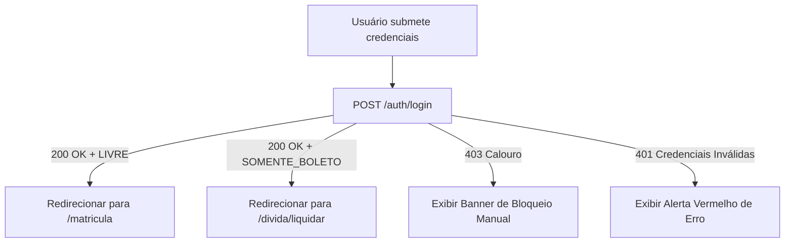

# Especificação de Tela: Login (`/login`)

## 1. Visão Geral
Tela inicial de autenticação onde o estudante insere suas credenciais institucionais para acesso ao portal acadêmico.

---

## 2. Elementos de Interface
- **Título / Cabeçalho:** Logotipo institucional e título "Portal de Matrícula Académica".
- **Formulário de Acesso:**
  - Campo `Código de Estudante` (Input numérico/alfanumérico, autofocus).
  - Campo `Senha` (Input password com alternador de visibilidade).
  - Botão de Ação: `"Entrar no Portal"` (com spinner em estado de loading).

---

## 3. Fluxos de Comportamento e Redirecionamento

### 3.1 Tratamento de Erros Específicos
- **Calouro (HTTP 403):** Exibe banner em destaque: *"Matrícula de calouros é manual. Dirija-se à secretaria acadêmica."*
- **Credenciais Inválidas (HTTP 401):** *"Código de estudante ou senha incorretos."*
- **Serviço Indisponível (HTTP 503 / Timeout):** *"Serviço temporariamente indisponível. Tente novamente em instantes."*
